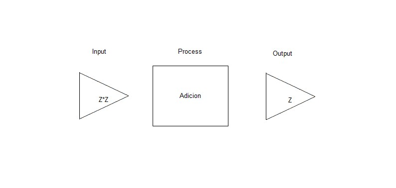
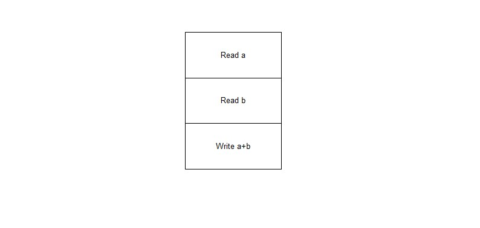

# CppAdicion

Problema:
Obtener del usuario dos números y mostrarle la suma.

Ingresar dos numeros enteros y devolver un numero entero que muestre la suma de los mismos.

Léxico del Algoritmo:
a,b ͼ Z

Representación textual:
1) Leer a.
2) Leer b.
3) Mostrar a+b.

Representación visual:

