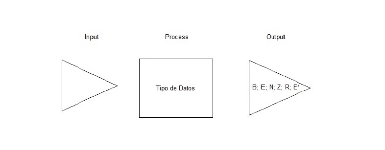
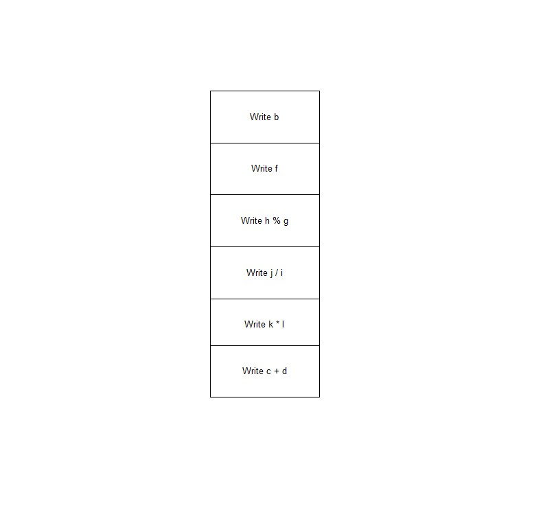

# CppTipoDatos

Problema:
Diseñar un programa C++ que ejemplifique la aplicación de los tipos de datos vistos en clases.

Realizar operaciones con datos del tipo bool,char, unsigned, int, double, y string. Mostrarlas por pantalla.

Léxico del Algoritmo:
a,b ͼ B

e,f ͼ Σ

g.h ͼ N

i,j ͼ Z

k,l ͼ R

c,d ͼ Σ* 

Representación textual:
1) Mostrar b.
2) Mostrar f.
3) Mostrar h%g.
4) Mostrar j/i.
5) Mostrar k*l.
6) Mostrar c+d.

Representación visual:

